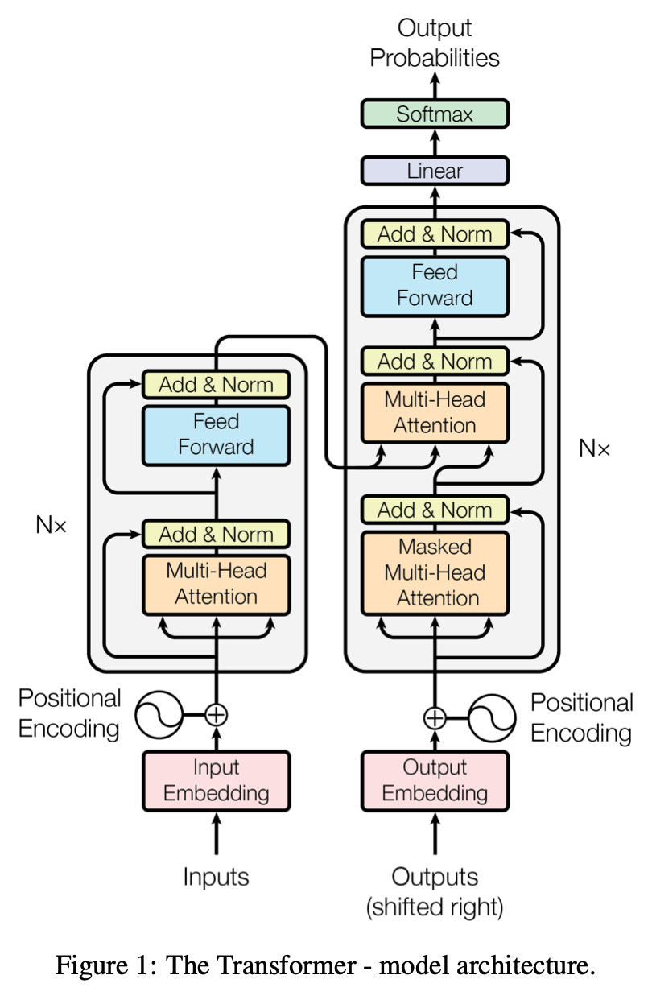
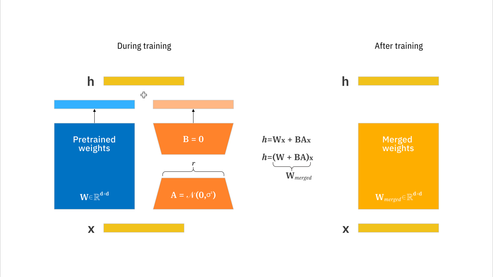
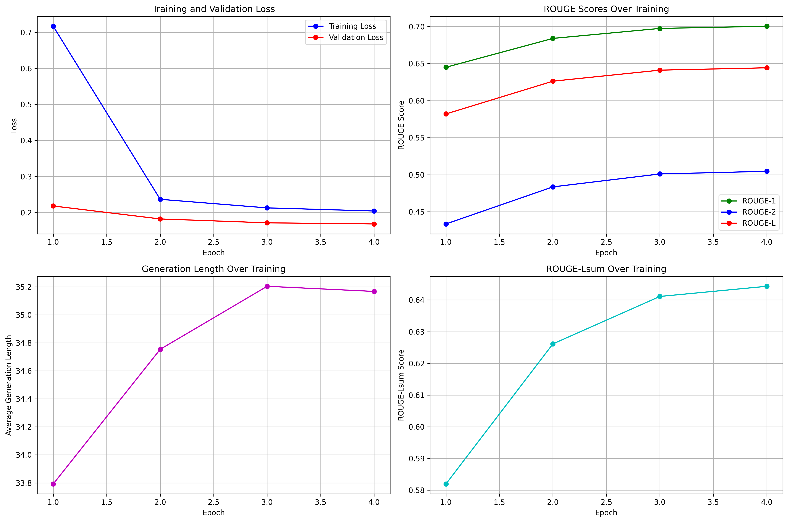
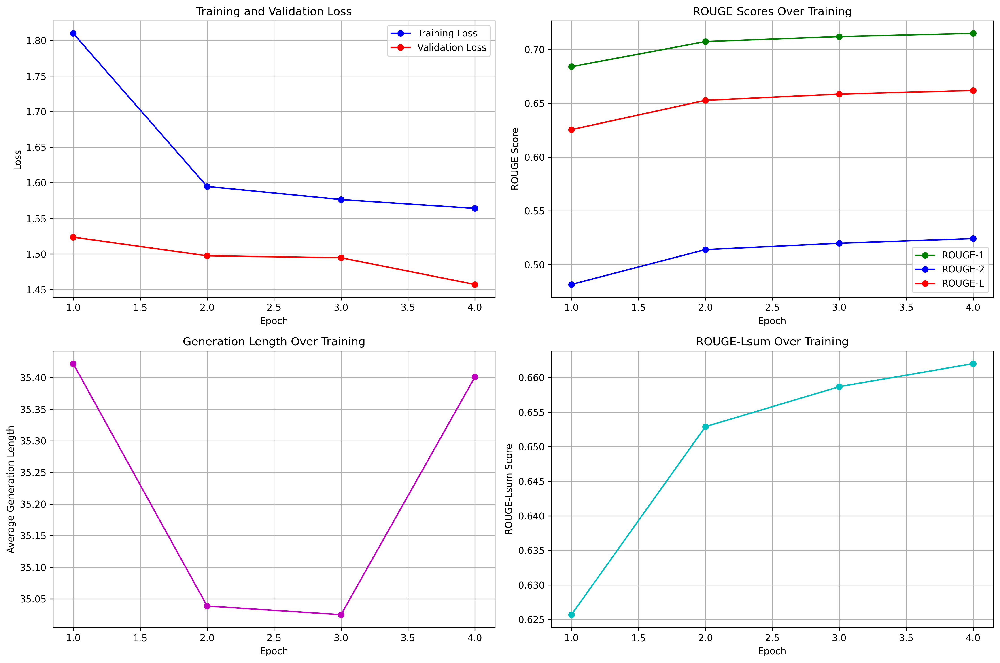
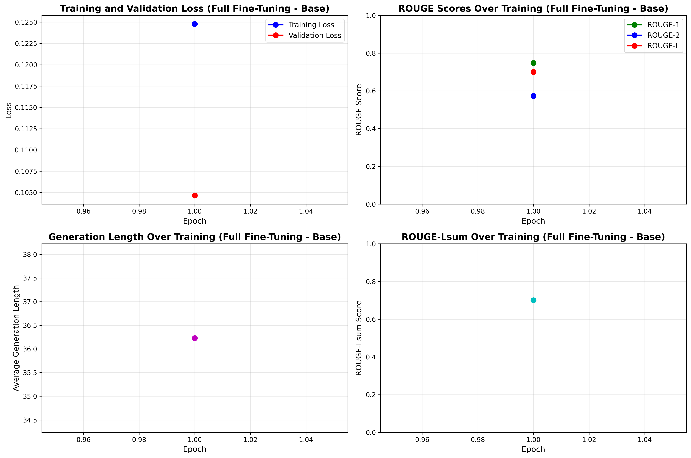
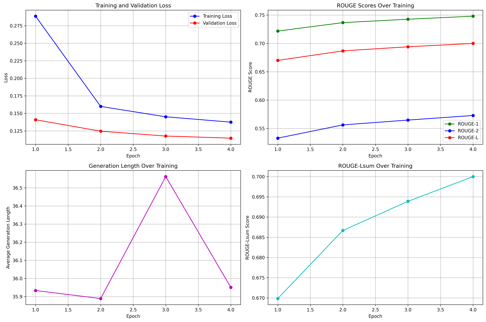
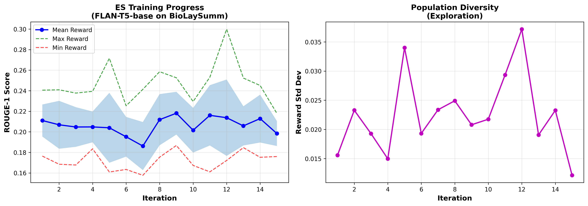

#  Fine tuning FLAN-T5 to translate expert radiology reports into layperson summaries  using the BioLaySumm dataset

Author: Jevi Waugh
## Overview 
This project investigates the full fine tuning of Google's FLAN-T5 models (small and base) for the task of translating expert radiology reports into an easy laman summary using the BioLaySumm 2025 dataset. There were three main approaches although we focus heavily on two of them. We compared Full fine tuning where all parameters were updated vs LoRA adapter which is a parameter efficient fine tuning methoc (PEFT), updating only a small subset of adpater weights. 
The third method is an optimisation technique inspired by biological evolution that optimises model parameters without computing gradients, which will be exploreda and trained, but not in its entirety.

This comparative analysis aims to evaluate the trade-offs between compute and model performance for domain-specific text especifically summarisation texts. 
The architecture of the vanilla T5 model is shown below to showcase some of its achitectural systems as FLAN-T5 is just a fine-tuned version.


[Attention Is All You Need](https://arxiv.org/pdf/1706.03762)
## Table of Contents
1. [Introduction](#introduction)
2. [Algorithms](#algorithms)
3. [Dataset](#dataset)
4. [Evolution Strategies (ES) Algorithm](#evolution-strategies-es-algorithm)
5. [Models and Architectures](#models-and-architectures)
6. [LoRA Method and Mathematics](#lora-details)
7. [Fine-Tuning Strategies](#fine-tuning-methods)
8. [Hardware Configuration](#hardware-configuration)
9. [Training Procedure](#training-procedure)
10. [Results and Evaluation](#results-and-evaluation)
11. [Visualisations and Plots](#visualisations-and-plots)
12. [Inference and Prediction Examples](#prediction-examples)
13. [Comparative analysis](#comparative-analysis)
14. [Error Analysis](#error-analysis)
15. [Reproducibility](#reproducibility)
16. [Access to project](#project-access)
17. [References](#references)
---

## Introduction
This project addresses the need to develop automated systems that can translate experts reports into clear, accessible summaries. This is mainly due to the advanced terminologies present in medical documentation that may overwelm the patient.


## Directory Structure
Notes that model files are hidden for now.
```
.
├── README.md                          # Project documentation
├── requirements.txt                   # Python dependencies
├── .gitignore                         # Git ignore rules (ignores mostly model and checkpoint files)
│
├── dataset.py                         # Dataset loading and preprocessing
├── modules.py                         # Model definitions (FLAN-T5, FLAN-T5-LoRA)
├── train.py                           # Main training point
├── predict.py                         # Inference and prediction script (generating summaries and plots)
│
├── results.txt                        # Raw training logs and evaluation metrics from Google collab
│
├── outputs/                           # All experiment outputs
│   |
│   ├── output_es_flan_base/           # Evolution Strategies + FLAN Base
│   │   ├── training_curves.png
|   |   |__ final_model
│   │   └── checkpoints/
│   │       └── [model checkpoint files]
│   |
│   ├── output_full_finetuning_base/   # Full Fine-Tuning (Base model)
│   │   ├── training_curves.png
|   |   |__ final_model
│   │   └── checkpoints/
│   │       └── [model checkpoint files]
│   |
│   ├── output_full_finetuning_small/  # Full Fine-Tuning (Small model)
│   │   ├── training_curves.png
│   │   └── final_model/
│   |     
│   |
│   ├── output_lora_base/              # LoRA Fine-Tuning (Base model)
│   │   ├── training_curves.png
|   |   |__ final_model
│   │   └── checkpoints/
│   │       └── [model checkpoint files]
│   |
│   ├── output_lora_small/             # LoRA Fine-Tuning (Small model)
│   │   ├── training_curves.png
│   │   └── final_model/
│   |      
│   |
│   └── lora_vs_fft_comparison_3epochs.png  # Comparative plot of LoRA vs 
|   |__lora.png
|   |__T5.jpg
└── 

```
## Algorithms
We compare 2 fine-tuning and 1 Evolution paradigms :

1. **Full Fine-Tuning (FFT)**: Traditional fine-tuningapproach updating all ~77M (small) or ~248M (base) parameters.

2. **Low-Rank Adaptation (LoRA)**: Parameter-efficient approach updating only ~1.8M (small) or ~7.1M (base) parameters (~2.2-2.8% of total parameters) (This will be specific in LoRA training in later sections)

3. **Evolution Strategies** is a black-box optimisation technique inspired by biological evolution that optimises model parameters without computing gradients.

The training was initially performed on **Google Colab** with GPU acceleration (Nvidea A100).
## Dataset

### Dataset Statistics

| Split | Examples |
|-------|----------|
| **Train** | 150,454 |
| **Validation** | 10,000 |
| **Test** | 10,537 |
| **Total** | 170,991 |

Note: The validation is used primarily for testing, as the testing set does not have the reference for its corresponding radiology_report.
### Data Structure of the dataset

Each data point contains:
- **`radiology_report`**: Detailed medical report written in professional terminology
- **`layman_report`**: Simplified version of the report for patient understanding
- **`images_path`**: File path to the associated medical image

### Preprocessing and Tokenisation

The preprocessing pipeline has the following steps:

1. **Prompt Engineering**: A task-specific prefix is prepended to each input:
   ```
   "Create a lay summary of this radiology report for a general audience: "
   ```

2. **Tokenisation**: 
   - **Model**: FLAN-T5 tokeniser (`google/flan-t5-small` or `google/flan-t5-base`)
   - **Padding**: Applied to maximum length for efficient batching purposes
   - **Input Length**: Max 512 tokens (truncated if longer)
   - **Target Length**: Max 256 tokens (usually half)

3. **Data Collation**: Dynamic padding using Pytorch's `DataCollatorForSeq2Seq` to optimise memory usage during training

4. **Batching**: 
   - **Small model**: 16 samples per batch
   - **Base model**: 10 samples per batch (due to larger memory)

The preprocessing is very much handled by the `BioDatasetLoader` class in `dataset.py`, which actually provides a clean interface for loading, tokenising, and batching the data. This has a modular design for simplicty purposes. Refer to later sections for the code and intialisation.

---

## Evolution Strategies (ES) Algorithm
### Overview
Evolution Strategies is a derivative-free optimisation method that treats model parameters as a population of candidate solutions. Unlike traditional backpropagation:

- **No gradients required**: ES estimates fitness (loss) by directly evaluating perturbed parameters
- **Natural gradient approximation**: The ES gradient is computed by weighting parameter perturbations by their fitness
- **Population-based**: Multiple parameter variants are evaluated in parallel
### Why is ES being used for LLM Fine-Tuning?
1. **Robustness**: ES can escape sharp local minima that trap gradient descent
2. **Parallelisation**: Each fitness evaluation is independent, enabling massive parallelisation
3. **Gradient-free**: Useful when gradients are noisy or difficult to compute
4. **Exploration**: Natural exploration of parameter space through random perturbations

The core ES update rule can be expressed as:

$$\theta_{t+1} = \theta_t + \alpha \frac{1}{n\sigma} \sum_{i=1}^{n} F(\theta_t + \sigma \epsilon_i) \epsilon_i$$

Where:
- $\theta_t$ represents model parameters at iteration $t$
- $\alpha$ is the learning rate
- $\sigma$ is the noise standard deviation
- $\epsilon_i \sim \mathcal{N}(0, I)$ are random perturbations
- $F(\cdot)$ is the fitness function (negative loss)
- $n$ is the population size

## Models and Architectures
### FLAN-T5 Architecture
FLAN-T5 (Fine-tuned Language Net - Text-to-Text Transfer Transformer version 5) is an encoder-decoder transformer model developed by Google. It basically builds on the original T5 architecture with extensive instruction fine-tuning.
**Main Architectural features:**
- **Encoder-Decoder Structure**: Separate encoder for input processing and then it has its own decoder for generative outputs.
- **Multi-Head Attention**: 6-12 heads depending on the model size
- **Feed-Forward Networks**: Gated linear units (GLU) in each layer
- **Relative Position Embeddings**: It improves generalisation to varying sequence lengths.

### Model types
FLAN-T5 is an instruction-tuned version of the T5 model. 
#### 1. FLAN-T5-Small
- **Parameters**: 76,961,152 (77 Million)
- **Attention Heads**: 8
- **Hidden Size**: 512
- **Feed-Forward Size**: 2048
- **Layers**: 6 encoder + 6 decoder layers
- **Use Case**: Quick demo and constrained environment

#### 2. FLAN-T5-Base
- **Parameters**: 247,577,856 (248 Million)
- **Attention Heads**: 12
- **Hidden Size**: 768
- **Feed-Forward Size**: 3072
- **Layers**: 12 encoder + 12 decoder layers
- **Use Case**: Higher quality generative results and for deployments

### Parameter Comparison: Full Fine-Tuning vs LoRA
| Model | Strategy | Total Parameters | Trainable Parameters | Trainable % | Memory Footprint |
|-------|----------|------------------|----------------------|-------------|------------------|
| **FLAN-T5-Small** | Full Fine-Tuning | 76,961,152 | 76,961,152 | 100.00% | ~300 MB |
| **FLAN-T5-Small** | LoRA (r=16) | 78,730,624 | 1,769,472 | 2.25% | ~310 MB |
| **FLAN-T5-Base** | Full Fine-Tuning | 247,577,856 | 247,577,856 | 100.00% | ~950 MB |
| **FLAN-T5-Base** | LoRA (r=32) | 254,655,744 | 7,077,888 | 2.78% | ~980 MB |

- LoRA adds only 1.8M-7.1M parameters (adapter weights) on top of frozen base model
- Inference speed is very close to being the same between LoRA and full models
- Training memory in terms of gradients is reduced by 95-98%

### Fine-tuning in models?

#### Full Fine-Tuning (FFT)
Updates **all parameters** including:
- Query (Q), Key (K), Value (V) projection matrices
- Feed-forward network weights (wi, wo)
- Output projection (O) matrices
- Layer normalisation parameters

#### LoRA Fine-Tuning (PEFT)
Updates **only low-rank adapter matrices** in:
- All other parameters stay frozen
- Target modules: `["q", "v", "k", "o", "wi", "wo"]` (configurable)
- Typically focuses on attention layers for efficiency

---

## LoRA concept
**Low-Rank Adaptation (LoRA)** is a parameter-efficient method that dramatically reduces the number of trainable parameters while maintaining competitive performance. The key insight is that the weight updates during fine-tuning lie in a low-dimensional subspace.

[IBM - What is LoRA?](https://www.ibm.com/think/topics/lora)

### LoRA Configuration in This Project for summaries

```python
lora_config = LoraConfig(
    r=16,                          # Rank (small) or 32 (base)
    target_modules=["q", "v", "k", "o", "wi", "wo"],  # All attention + FFN
    lora_alpha=32,                 # Scaling: 2×r (small) or 64 (base)
    bias="none",                   # No bias terms
    task_type="SEQ_2_SEQ_LM"       # Encoder-decoder task
    lora_dropout=0.1,              # Dropout on LoRA layers
)
```
### Advantages of LoRA
**Advantages:**
- **Modular Adapters**: Easy to swap task-specific adapters
- **Memory Efficient**: 95-98% reduction in trainable parameters
- **Faster Training**: Few gradients to compute and store in computational graph
- **Better Generalisation**: Reduced overfitting on small datasets

---
### Tradeoffs and Disadvantages of LoRA
**Trade-offs:**
- **Hyperparameter Sensitivity**: Performance depends on choice of $r$ and $\alpha$
- **Capacity**: Low rank may limit model's adaptation capacity
- **Module Selection**: Optimal target modules vary by architecture
- **Training with adapter**: Training may take longer for more adapters due to the rank of matrices and matrix multiplication of the maximum adapter loaded.

## Comparison Table
| Aspect | Full Fine-Tuning | LoRA Fine-Tuning |
|--------|------------------|------------------|
| **Trainable Parameters** | 100% (77M / 248M) | 2.25% / 2.78% (1.8M / 7.1M) |
| **GPU Memory (Training)** | ~16-24 GB | ~8-12 GB |
| **Training Speed** | Baseline | Baseline |
| **Convergence** | Slower (more parameters) | Faster (fewer parameters) |
| **Overfitting Risk** | Higher | Lower |
| **Best Performance** | baseline | slightly higher (~1-2% ROUGE) |
| **Flexibility** | Maximum | Limited by rank |
| **Deployment** | Single large model | Lightweight adapters |

---

## Hyperparameter Settings

### FLAN-T5-Small

| Hyperparameter | Full Fine-Tuning | LoRA |
|----------------|------------------|------|
| Learning Rate | 4e-5 | 3e-4 |
| Batch Size | 16 | 16 |
| Epochs | 4 | 4 |
| Warmup Steps | 500 | 500 |
| Weight Decay | 0.01 | 0.01 |
| Max Input Length | 512 | 512 |
| Max Target Length | 256 | 256 |
| LoRA Rank (r) | N/A | 16 |
| LoRA Alpha | N/A | 32 |
| LoRA Dropout | N/A | 0.1 |

### FLAN-T5-Base

| Hyperparameter | Full Fine-Tuning | LoRA |
|----------------|------------------|------|
| Learning Rate | 4e-5 | 3e-4 |
| Batch Size | 10 | 10 |
| Epochs | 4 (stopped at 3) | 4 |
| Warmup Steps | 500 | 500 |
| Weight Decay | 0.01 | 0.01 |
| Max Input Length | 512 | 512 |
| Max Target Length | 256 | 256 |
| LoRA Rank (r) | N/A | 32 |
| LoRA Alpha | N/A | 64 |
| LoRA Dropout | N/A | 0.1 |
| LoRA Modules | N/A | `["q", "v", "k", "o", "wi", "wo"]` |

**Notes:**
- A higher learning rate was used for LoRA due to smaller parameter space.
- Batch sizes were constrained by GPU memory limits
- Full fine-tuning of base model stopped early due compute contraints in Google collab.

---

## Hardware Configuration

- **Platform**: Google Colab Pro
- **GPU**: 
  - Nvidea A100 (32 GB VRAM) for small and base model experiments
- **System RAM**: 40-80 GB (depending on experiments)
- **Disk**: 255GB
- **CUDA Version**: 12.2
- **PyTorch Version**: 2.1.0

## Training 
### Training Time Summary


| Model | Strategy | Epochs | Batch Size | Training Time | GPU Utilisation |
|-------|----------|--------------|------------|---------------|-----------------|
| FLAN-T5-Small | Full Fine-Tuning | 4 | 16 | ~ 1.38 hours | ~60% |
| FLAN-T5-Small | LoRA | 4 | 16 | ~ 1.9 hours | ~75% |
| FLAN-T5-Base | Full Fine-Tuning | 4* (3) | 10 | ~ 3.3 hours | ~85% |
| FLAN-T5-Base | LoRA | 4 | 10 | ~ 4.18 hours | ~95% |
| FLAN-T5-Base | Evolution Strategies | 15 | 10 (pop) | **~45 minutes** | ~70% |

*Interrupted due to Colab compute limits.

**Evolution Strategies Configuration**:
- **Population Size**: 10 candidate models per iteration
- **Fitness Evaluations**: 30 validation samples per candidate
- **Time per Iteration**: ~3 minutes (10 × 18 seconds per candidate)
- **Total Iterations**: 15
- **Speedup**: 4-11× faster per iteration than gradient-based training

### Training Procedure
The training pipeline follows a systematic multi-stage process:

#### Stage 1: Dataset Preparation
1. Load dataset from Hugging Face Hub from dataset
2. Apply train/validation/test splits

#### Stage 2: Tokenisation
1. Initialise FLAN-T5 tokeniser
2. Apply task-specific prefix to inputs
3. Tokenise inputs (max 512 tokens) and targets (max 256 tokens)
4. Create data collator for dynamic padding

#### Stage 3: Model set up
1. Load pre-trained FLAN-T5 checkpoint
2. **For LoRA**: Apply LoRA configuration and freeze base weights
3. **For FFT**: Ensure all parameters require gradients
4. Move model to GPU

#### Stage 4: Training Configuration
1. Configure training arguments 
2. Initialise optimiser (AdamW with weight decay)
3. Set up learning rate scheduler (linear warmup + decay)
4. Configure mixed-precision training (BFloat16)

#### Stage 5: Training Loop
1. Manual training loop

#### Stage 6: Final Evaluation and Saving 
1. Load best checkpoint
2. Evaluate on validation set
3. Generate sample predictions
4. Save final model and training curves


<!-- we put this inside for now -->
### Driver script via Command Line interface


The training scripts support flexible command-line arguments for easy experimentation:

#### Training Script (`train.py`)

```bash
# Full Fine-Tuning (FLAN-T5-Small)
python3 train.py 

# LoRA (FLAN-T5-Small) modify main
main(use_lora=True, base_output_dir="./outputs/output_full_finetuning_small"):
python3 train.py 

# Evolution Strategies Training - modify main
trainer = ESTrainer(
        model_name="google/flan-t5-base",
        output_dir=./outputs/output_es_flan_base
    )
python train.py 
```

#### Prediction Script (`predict.py`)

```bash
# Generate predictions from checkpoint
python predict.py 
    --model_path outputs/output_lora_base/final_model 
    --is_lora 
    --num_examples 5 
    --calculate_rouge
```

---

### Key Training Arguments

```python
Seq2SeqTrainingArguments(
    output_dir="./outputs",
    learning_rate=2e-5,                # AdamW learning rate
    evaluation_strategy="epoch",       # Evaluate after each epoch
    weight_decay=0.01,                 # L2 regularisation
    num_train_epochs=4,                # Total epochs
    per_device_eval_batch_size=16,    # Evaluation batch size
    save_strategy="epoch",             # Save after each epoch
    save_total_limit=2,                # Keep only 2 best checkpoints
    per_device_train_batch_size=16,   # Training batch size
    metric_for_best_model="rouge1",   # Selection criterion
    load_best_model_at_end=True,      # Load best for final eval
    greater_is_better=True,
    bf16=True,                         # Use BFloat16 mixed precision
    fp16=False,                        # Use FP32 (BF16 used instead)
    gradient_accumulation_steps=1,     # Accumulate gradients
    logging_steps=100,                 # Log every N steps
    warmup_steps=500,                  # LR warmup steps
    generation_max_length=256,         # Max tokens to generate
    predict_with_generate=True,        # Use generation for eval
)
```

---
## Results and Evaluation

### Evaluation Metrics

All of the models are evaluated using **ROUGE (Recall-Oriented Understudy for Gisting Evaluation)** scores, which are excellent at measuring the overlap between generated expert level summaries and reference summaries for patients:

- **ROUGE-1**: Unigram overlap
- **ROUGE-2**: Bigram overlap
- **ROUGE-Lsum**: LCS computed at the summary level
- **ROUGE-L**: Longest common subsequence

Higher ROUGE scores indicate better summary in terms of quality. Scores range from 0 to 100\%.

---

### Results Summary
#### Full Fine-Tuning (4 Epochs)

| Epoch | Train Loss | Val Loss | ROUGE-1 | ROUGE-2 | ROUGE-L | ROUGE-Lsum | Gen Length |
|-------|------------|----------|---------|---------|---------|------------|------------|
| 1 | 0.7169 | 0.2183 | 0.6450 | 0.4335 | 0.5820 | 0.5819 | 33.79 |
| 2 | 0.2368 | 0.1824 | 0.6840 | 0.4836 | 0.6262 | 0.6261 | 34.75 |
| 3 | 0.2131 | 0.1716 | 0.6974 | 0.5010 | 0.6411 | 0.6411 | 35.20 |
| **4** | **0.2045** | **0.1656** | **0.7047** | **0.5084** | **0.6493** | **0.6493** | **35.40** |

**Training Time**: 1.38 hrs
### Full Fine-Tuning Training (FLAN-T5-Small)



#### LoRA Fine-Tuning (4 Epochs)

| Epoch | Train Loss | Val Loss | ROUGE-1 | ROUGE-2 | ROUGE-L | ROUGE-Lsum | Gen Length |
|-------|------------|----------|---------|---------|---------|------------|------------|
| 1 | 1.8099 | 1.5236 | 0.6839 | 0.4817 | 0.6255 | 0.6257 | 35.42 |
| 2 | 1.5948 | 1.4974 | 0.7073 | 0.5140 | 0.6527 | 0.6529 | 35.04 |
| 3 | 1.5764 | 1.4946 | 0.7119 | 0.5199 | 0.6585 | 0.6587 | 35.02 |
| **4** | **1.5640** | **1.4571** | **0.7149** | **0.5243** | **0.6619** | **0.6620** | **35.40** |

**Training Time**: 1.9

**Note**: Higher training/validation loss values are expected with LoRA due to different loss scaling and limited parameter updates, but ROUGE scores remain competitive.
### LoRA Training (FLAN-T5-Small)



---

#### FLAN-T5-Base

#### Full Fine-Tuning (~1.5 Epochs)

| Epoch | Train Loss | Val Loss | ROUGE-1 | ROUGE-2 | ROUGE-L | ROUGE-Lsum | Gen Length |
|-------|------------|----------|---------|---------|---------|------------|------------|
| 1 | 0.3631 | 0.1457 | 0.7047 | 0.5124 | 0.6492 | 0.6493 | 34.83 |
| 2 | 0.1539 | 0.1195 | 0.7349 | 0.5524 | 0.6844 | 0.6843 | 35.61 |
| 3 | 0.1347 | 0.1113 | 0.7416 | 0.5633 | 0.6925 | 0.6923 | 35.67 |
| **4*** | **---** | **---** | **---** | **---** | **---** | **---** | **---** |

*Training interrupted at 24% of Epoch 4 due to Colab session timeout.

**Training Time**: 3.3 hrs
### Full Fine-Tuning Training (FLAN-T5-Base)


#### LoRA Fine-Tuning (4 Epochs)

| Epoch | Train Loss | Val Loss | ROUGE-1 | ROUGE-2 | ROUGE-L | ROUGE-Lsum | Gen Length |
|-------|------------|----------|---------|---------|---------|------------|------------|
| 1 | 0.2886 | 0.1409 | 0.7217 | 0.5328 | 0.6700 | 0.6699 | 35.93 |
| 2 | 0.1599 | 0.1246 | 0.7366 | 0.5562 | 0.6868 | 0.6867 | 35.89 |
| 3 | 0.1451 | 0.1177 | 0.7427 | 0.5647 | 0.6940 | 0.6939 | 36.56 |
| **4** | **0.1375** | **0.1147** | **0.7480** | **0.5728** | **0.6999** | **0.7000** | **35.95** |

**Training Time**: 4.18 hrs

### LoRA Training (FLAN-T5-base)



#### Evolution Strategies (ES) Training (15 Iterations)

| Iteration | Mean Reward (ROUGE-1) | Min Reward | Max Reward | Std Dev | Time (s) |
|-----------|----------------------|------------|------------|---------|----------|
| 1 | 0.2110 | 0.1764 | 0.2405 | 0.0156 | 191.60 |
| 2 | 0.2068 | 0.1685 | 0.2409 | 0.0233 | 184.58 |
| 3 | 0.2047 | 0.1677 | 0.2377 | 0.0193 | 164.51 |
| 4 | 0.2048 | 0.1835 | 0.2394 | 0.0150 | 172.64 |
| 5 | 0.2039 | 0.1609 | 0.2715 | 0.0340 | 179.81 |
| 6 | 0.1952 | 0.1634 | 0.2253 | 0.0193 | 185.39 |
| 7 | 0.1862 | 0.1577 | 0.2414 | 0.0234 | 203.92 |
| 8 | 0.2118 | 0.1753 | 0.2585 | 0.0249 | 181.63 |
| 9 | **0.2181** | 0.1867 | 0.2526 | 0.0208 | 171.58 |
| 10 | 0.2016 | 0.1673 | 0.2295 | 0.0217 | 183.00 |
| 11 | 0.2161 | 0.1610 | 0.2532 | 0.0293 | 170.13 |
| 12 | 0.2137 | 0.1721 | **0.2998** | 0.0372 | 189.70 |
| 13 | 0.2058 | 0.1846 | 0.2523 | 0.0191 | 164.86 |
| 14 | 0.2129 | 0.1752 | 0.2451 | 0.0233 | 175.59 |
| 15 | 0.1983 | 0.1760 | 0.2179 | 0.0121 | 175.54 |

**ES Training Configuration**:
- **Population Size**: 10 candidate solutions per iteration
- **Noise Scale (σ)**: 0.001
- **Learning Rate (α)**: 0.0005
- **Validation Samples**: 30 samples per fitness evaluation
- **Total Parameters**: 247,577,856 (all parameters perturbed)

**Training Time**: ~45 minutes (2700.89 seconds total)
### Evolution Strategies Training (FLAN-T5-Base)

**Performance**:
- Peak performance at Iteration 9 with mean ROUGE-1 of 0.2181
- Maximum individual reward of 0.2998 achieved at Iteration 12
- High variance in rewards indicates diverse exploration of parameter space
- Significantly faster than gradient-based training (~3 min/iteration vs ~50 min/epoch)
- Final performance (ROUGE-1: 0.1983) significantly lower than LoRA or FFT


### Comparative Analysis
#### Strategy Comparison (FLAN-T5-Small, 4 Epochs)

| Strategy | Parameters | GPU Time | ROUGE-1 | ROUGE-2 | ROUGE-L | ROUGE-Lsum |
|----------|------------|----------|---------|---------|---------|------------|
| **Full Fine-Tuning** | 76,961,152 | 1.38 hrs | 0.7047 | 0.5084 | 0.6493 | 0.6493 |
| **LoRA** | 1,769,472 | 1.9 hrs | **0.7149** | **0.5243** | **0.6619** | **0.6620** |

**Key Findings:**
- LoRA achieves **slightly higher ROUGE scores** (+1.0-1.6%) with 97.7% fewer parameters
- LoRA training took **3.3× longer** due to slower per-iteration speed on small models
- Both strategies converge to similar performance, validating LoRA's effectiveness
#### Model Size Comparison (LoRA Strategy, 4 Epochs)

| Model | Parameters | GPU Time | ROUGE-1 | ROUGE-2 | ROUGE-L | ROUGE-Lsum |
|-------|------------|----------|---------|---------|---------|------------|
| **FLAN-T5-Small** | 1.8M (2.25%) | 1.9 hrs | 0.7149 | 0.5243 | 0.6619 | 0.6620 |
| **FLAN-T5-Base** | 7.1M (2.78%) | 4.18 hrs | **0.7480** | **0.5728** | **0.6999** | **0.7000** |

**Key Findings:**
- Base model achieves **+3.3-4.9% ROUGE improvement** over small model
- Base model required **1.9× longer training time**
- Performance gains justifies additional compute for production purposes.

#### Training Strategy Comparison (FLAN-T5-Base)

| Strategy | Trainable Params | Training Time | Best ROUGE-1 | Convergence | Stability |
|----------|------------------|---------------|--------------|-------------|-----------|
| **Full Fine-Tuning** | 247.6M (100%) | 3.3 hrs| 0.7416* (Epoch 3) | Fast | Stable |
| **LoRA** | 7.1M (2.78%) | 4.18hrs | **0.7480** (Epoch 4) | Fast | Stable |
| **Evolution Strategies** | 247.6M (100%) | ~45 min (15 iter) | 0.2181 (Iter 9) | slow | High variance |

- Full fine-tuning likely would have improved further if completed
- ES is considered slow due to its stochastic nature in random sampling which may continously change the scores. Hence, it requires a lot more compute in general.

### LoRA vs Full Fine-Tuning Comparison (3 Epochs)
We plot for three epochs because FFT for the base model had been interrupted due to compute constraints.


---


### Winning Model Performance
**Winning Configuration**: **FLAN-T5-Base with LoRA (Epoch 3)**

| Metric | Score |
|--------|-------|
| ROUGE-1 | **0.7480** |
| ROUGE-2 | **0.5728** |
| ROUGE-L | **0.6999** |
| ROUGE-Lsum | **0.7000** |
| Average Generation Length | 35.95 tokens |

This configuration achieves the best balance of:
- High-quality summaries (highest ROUGE scores)
- Parameter efficiency (2.78% trainable parameters)
- Reasonable training time (~8.5 hours)
- Production-ready deployment (lightweight adapters)

Note:  LoRA here takes longer due to the maximum adapater loaded, otherwise it would have taken less time.

---


### Expected Observations
This section demonstrates the model's performance on real radiology reports from the validation set. Predictions were generated using the best checkpoint (FLAN-T5-Base with LoRA) with beam search decoding.

## Prediction Examples
### Example 1

**Input (Expert Radiology Report)**:

The chest shows significant air trapping. Bilateral apical chronic changes are present. Dorsal kyphosis is noted. No evidence of pneumothorax.


**Model Prediction (Generated Layperson Summary)**:

The chest x-ray shows that there is a lot of air trapped in the lungs. There are long-term changes at the top of both lungs. The upper back is curved outward. There is no sign of air outside the lungs.


**Reference (Ground Truth Layperson Summary)**:

The chest shows a large amount of trapped air. There are long-term changes at the top of both lungs. The upper back is curved outward. There is no sign of air in the space around the lungs.


---

### Example 2

**Input (Expert Radiology Report)**:

Central venous catheter traversing the left jugular vein with its tip in the superior vena cava. The remainder is unchanged.


**Model Prediction (Generated Layperson Summary)**:

A central venous catheter is going through the left jugular vein and its tip is in the superior vena cava. Everything else looks the same as before.


**Reference (Ground Truth Layperson Summary)**:

A central venous catheter is going through the left jugular vein and its tip is in the superior vena cava. Everything else is the same as before.


---

### Example 3

**Input (Expert Radiology Report)**:

Chronic pulmonary changes


**Model Prediction (Generated Layperson Summary)**:

Long-term changes in the lungs are seen.


**Reference (Ground Truth Layperson Summary)**:

Long-term changes in the lungs are seen.


---

### Example 4

**Input (Expert Radiology Report)**:

Radiological signs of air trapping, flattened diaphragm, and increased retrosternal space. Calcified pleural plaques at the level of the left diaphragmatic pleura. Loss of volume in the left lung with subpleural linear opacities. Findings are related to chronic inflammatory changes due to asbestos exposure. Review of previous CT scan shows no significant changes compared to the scanogram dated 3/4/2009.


**Model Prediction (Generated Layperson Summary)**:

The radiology images show signs of air being trapped in the lungs, the diaphragm is flattened, and there's an increased space behind the breastbone. There are calcified plaques on the left side of the diaphragm lining. The left lung has lost some volume and there are linear opacities near the lung surface. These findings are related to long-term inflammation due to asbestos exposure. Looking at the previous CT scan, there are no significant changes compared to the scanogram dated 3/4/2009.


**Reference (Ground Truth Layperson Summary)**:

The X-ray shows signs of trapped air, a flattened muscle under the lungs, and more space behind the breastbone. There are also hardened areas on the lung lining on the left side. The left lung has lost some volume and has some linear shadows near the outer lining. These findings are related to long-term inflammation caused by exposure to asbestos. Looking at the previous CT scan, there are no significant changes compared to the scanogram dated 3/4/2009.


---

### Example 5

**Input (Expert Radiology Report)**:
```
Calcified granuloma in the right lung vertex.
```

**Model Prediction (Generated Layperson Summary)**:
```
There is a calcified granuloma, which is a type of hardened lump, in the top part of the right lung.
```

**Reference (Ground Truth Layperson Summary)**:
```
There is a calcified granuloma located at the top of the right lung.
```

**Rouge scores based on 100 validation samples**
- ROUGE-1:    0.7328
- ROUGE-2:    0.5422
- ROUGE-L:    0.6730
- ROUGE-Lsum: 0.6737

---

## Project Access

### CUDA, GPU and Google Collab
 - CUDA Version: 12.2
 - GPU Driver: 535.104.05 (or use dfault google collab GPU)
 - Nvidea A100
### Dataset Access
To access the dataset, follow the following:
```python
from datasets import BioDatasetLoader

BioLoader = BioDatasetLoader(); 
# Load data
BioLoader.load_dataset()

# Retrieve training data
train = BioLoader.train

# Retrieve testing data
test = BioLoader.test

# Retrieve validation data
val = BioLoader.validation

```

## Reproducibility
```python
seed=4882967
```

**Random Seeds**:
- PyTorch: `4882967`
- NumPy: `4882967`
- Python: `4882967`
- Transformers: `4882967`


### Software Environment
#### Core Dependencies

| Package | Version | Purpose |
|---------|---------|---------|
| Python | 3.10.12 | Base interpreter |
| PyTorch | 2.1.0+cu121 | Deep learning framework |
| Transformers | 4.35.2 | Hugging Face model library |
| Datasets | 2.14.6 | Dataset loading and processing |
| PEFT | 0.6.0 | Parameter-efficient fine-tuning |
| Evaluate | 0.4.1 | Metric computation (ROUGE) |
| NumPy | 1.24.3 | Numerical operations |
| Accelerate | 0.24.1 | Distributed training utilities |
#### Supporting Libraries
```
tqdm>=4.66.0
matplotlib>=3.7.1
typing-extensions>=4.8.0
```
## References

### Main Literature

1. **FLAN-T5 Model**:
   - [Chung, H. W., Hou, L., Longpre, S., Zoph, B., Tay, Y., Fedus, W., ... & Wei, J. (2022). *Scaling instruction-finetuned language models*. arXiv preprint arXiv:2210.11416.](https://arxiv.org/abs/2210.11416)
2. **T5 Original Architecture**:
   - [Raffel, C., Shazeer, N., Roberts, A., Lee, K., Narang, S., Matena, M., ... & Liu, P. J. (2020). *Exploring the limits of transfer learning with a unified text-to-text transformer*. Journal of Machine Learning Research, 21(140), 1-67.](https://arxiv.org/abs/1910.10683)
3. **LoRA (Low-Rank Adaptation)**:
   - [Hu, E. J., Shen, Y., Wallis, P., Allen-Zhu, Z., Li, Y., Wang, S., ... & Chen, W. (2021). *LoRA: Low-Rank Adaptation of Large Language Models*. arXiv preprint arXiv:2106.09685.](https://arxiv.org/abs/2106.09685)

4. **Evolution Strategies**:
   - [Salimans, T., Ho, J., Chen, X., Sidor, S., & Sutskever, I. (2017). *Evolution strategies as a scalable alternative to reinforcement learning*. arXiv preprint arXiv:1703.03864.](https://arxiv.org/abs/1703.03864)

5. **ROUGE Evaluation Metric**:
   - [Lin, C. Y. (2004). *ROUGE: A package for automatic evaluation of summaries*. In Text summarization branches out (pp. 74-81).](https://aclanthology.org/W04-1013/)

6. Attention Is All You Need
   - [Vaswani, A., Shazeer, N., Parmar, N., Uszkoreit, J., Jones, L., Gomez, A. N., Kaiser, Ł., & Polosukhin, I. (2017). Attention Is All You Need.](https://arxiv.org/pdf/1706.03762)
---

### Software Documentation

6. **Hugging Face Transformers**:
   - [Transformers Documentation](https://huggingface.co/docs/transformers/)
   - [FLAN-T5 Model Card](https://huggingface.co/google/flan-t5-base)
   - [Summarisation Task Guide](https://huggingface.co/docs/transformers/en/tasks/summarization)

7. **Hugging Face PEFT Library**:
   - [PEFT Documentation](https://huggingface.co/docs/peft/)

8. **Hugging Face Datasets**:
   - [Datasets Documentation](https://huggingface.co/docs/datasets/)
   - [BioLaySumm Dataset](https://huggingface.co/datasets/BioLaySumm/BioLaySumm2025-LaymanRRG-opensource-track)

9. **PyTorch**:
   - [PyTorch Documentation](https://pytorch.org/docs/stable/index.html)
   - [Mixed Precision Training](https://pytorch.org/docs/stable/amp.html)

---

### Domain-Specific Resources

10. **Medical Text Summarisation**:
    - [BioLaySumm 2025](https://biolaysumm.org/)


11. **Parameter-Efficient Fine-Tuning (PEFT) Survey**:
    - [Lialin, V., Deshpande, V., & Rumshisky, A. (2023). *Scaling Down to Scale Up: A Guide to Parameter-Efficient Fine-Tuning*. arXiv preprint arXiv:2303.15647.](https://arxiv.org/abs/2303.15647)

---

### Additional References

12. [**IBM LoRA Overview**:](https://www.ibm.com/think/topics/lora)

---

### Citation for This Work

If you use this code or methodology in your research, please cite:

```bibtex
@misc{waugh2025flan_t5_lora_biolaysumm,
  author = {Waugh, Jevi},
  title = {Fine-Tuning FLAN-T5 using Full Fine-Tuning and LoRA for BioLaySumm},
  year = {2025},
  publisher = {GitHub},
  howpublished = {}
}
```

---

**End of README**